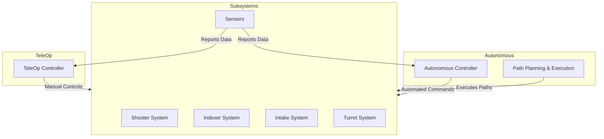
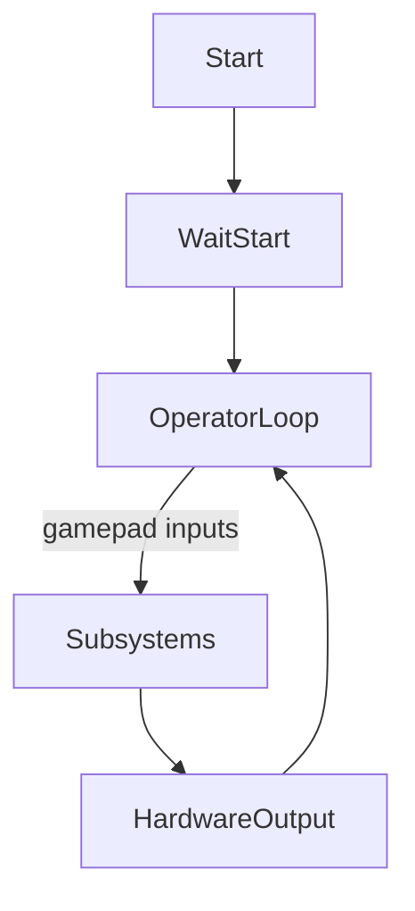

# FTC Team 19054 NeuroBotix - TeamCode Comprehensive Documentation

This document provides detailed coverage of all classes, mathematical logic, control algorithms, and architecture within the `teamcode` package for the FTC Team 19054 NeuroBotix. It is aligned with the FTC Control Award guidelines and includes mermaid diagrams for architecture and flow insight.

---

## Table of Contents

1. [Architecture Overview](#architecture-overview)
2. [Mermaid Diagrams](#mermaid-diagrams)
3. [Class-By-Class Documentation](#class-by-class-documentation)
   - [TeleOp Modes](#teleop-modes)
   - [Subsystems](#subsystems)
   - [Mathematical Models](#mathematical-models)
   - [Pathing and Autonomous](#pathing-and-autonomous)
4. [Mathematical Formulas & Logic](#mathematical-formulas--logic)
5. [FTC Control Award Checklist Mapping](#ftc-control-award-checklist-mapping)
6. [Software Engineering Best Practices](#software-engineering-best-practices)

---

## Architecture Overview

The robot's code follows a modular multi-class design, separating teleop modes, subsystems, autonomous modes, math helpers, and path planning for clear maintainability and high reliability.

### Main Components:

- **TeleOp Modes**: Control schemes for manual operation.
- **Subsystems**: Encapsulate specific hardware like shooter, turret, indexer, intake.
- **Math Utilities**: Classes for robot geometry, shooting calculation, sensor processing.
- **Pathing Components**: Support advanced autonomous navigation.
- **Hardware Integration**: Classes abstract hardware map interactions.

---

## Mermaid Diagrams

### Overall System Architecture



### Control Flow (TeleOp Example)



---

## Class-By-Class Documentation

### TeleOp Modes

**telop**
- **Purpose:** Implements a basic teleop routine; spins index and intake motors at full power while the OpMode is active.
- **Key Logic:**
    - Initializes motors and sets directions.
    - Waits for start, then runs motors in loop.
- **Control Award Features:** Clear state handling (`isStopRequested` check), hardware abstraction, safety by setting powers to zero pre-start.

**TeleOp (in opModes)**
- **Purpose:** Reads position data from file (`FinalPos.txt`) and outputs to console during teleop. Utilizes GoBildaPinpointDriver.
- **Key Logic:** Initializes, pulls pose values, and outputs to system.

### Subsystems

**Shooter**
- **Purpose:** Controls dual flywheel motors and shooter hood/barrier servo for shooting rings at targets.
- **Math/Control:** Adaptive hood algorithm, velocity control, selects power based on gamepad input.
- **Safety:** Barrier initialized in lowered position.
- **Award Relevance:** Robust error tolerance (adaptiveHood), configurable shoot ticks.

**Index**
- **Purpose:** Manages indexer for feeding rings into shooter.
- **Control:** Supports manual feed, auto-feed, stop, slowFeed routines.
- **Gamepad Integration:** Responsive to trigger inputs for direction/power.

**Turret**
- **Purpose:** Controls multi-servo turret for angular aiming.
- **Features:** Direction error correction, auto-centering, left/right/neutral positions.
- **Control Flow:** Uses difference in heading-angle for correction.

**Intake (implied from usage)**
- **Purpose:** Handles intake motor for ring collection.
- **Control:** Power management, direction control.

### Mathematical Models

**Movement**
- **Purpose:** Implements mecanum drive calculations; resolves joystick inputs into motor powers.
- **Math:** Uses classic holonomic wheel equations (`frontLeftPower = y + x + rx` etc).
- **Award Mapping:** Clear mapping of gamepad control to power outputs.

**ShooterCalculations**
- **Purpose:** Provides kinematic calculations for shooter trajectory and turret compensation.
- **Math Concepts:** Gravity compensation, servo positions mapped to angles, distance/heading calculation.
- **Award Mapping:** Advanced math for accurate shooting; supports telemetry reporting.

**Sensor**
- **Purpose:** Color sensor abstraction; detects "purple" and "green" for game element sensing.
- **Logic:** HSV color thresholding for decision logic.

**Position**
- **Purpose:** Tracks robot position using field geometry, manages state for blue/red alliance, provides offset calculations.
- **Math:** Utilizes trigonometric equations (cos/sin), triangle geometry, pose updating.

**LinearEquation**
- **Purpose:** Encapsulates basic linear equation parameters for trajectory calculation.

### Pathing & Autonomous

**RedFar, BlueFar, RedClose, BlueClose**
- **Purpose:** Autonomous routines for different starting positions.
- **Path Planning:** Defines paths via Bezier lines/curves.
- **State Machines:** Supports states (`SHOOT`, `DETECT`, etc.) and persistent pose writing for cross-mode sharing.
- **Complexity:** Mermaid diagram models path transitions.

**Constants**
- **Purpose:** Holds key constants for path planning and follower construction.
- **Award Mapping:** Centralizes configuration for tuning, supports easy reconfiguration (Control Award best practices).

---

## Mathematical Formulas & Logic

### Drive Power Calculation

**Mecanum equations** (from `Movement`):
```
frontLeftPower = (y + x + rx)
backLeftPower  = (y - x + rx)
frontRightPower= (y - x - rx)
backRightPower = (y + x - rx)
```
Where:
- `x` = strafe joystick
- `y` = forward/reverse joystick
- `rx` = rotation joystick

### Shooter Angle Compensation

From `ShooterCalculations`:
```
launchAngle = atan2(goalY - robotY, goalX - robotX)
flywheelSpeed = (distance * a) + b
hoodServoPosition = min(max(position), 1)
Compensate for gravity: GRAVITY = 386.1 in/s^2
```

### Color Sensing

From `Sensor`:
- **Purple:** `hue ∈ [210,330], saturation > 0.4, value > 0.1`
- **Green:** `hue ∈ [90,180], saturation > 0.4, value > 0.1`

---

## FTC Control Award Checklist Mapping

| Criteria | Package Features |
|----------|------------------|
| Robust architecture | Modular class-based design, isolated subsystems |
| Clear control logic | Encapsulated motor/servo logic, teleop/autonomous split |
| Sensor integration | Full color sensor support, game element detection |
| Error handling | State checks (`isStopRequested`), adaptive controls |
| Mathematical modeling | Dedicated classes for kinematics, geometry, trajectories |
| Data logging | Telemetry and pose data stored and reported via file |
| Tuning support | Constants centralized, path tuning abstractions |
| Documentation | This markdown, code comments, config files |
| Best practices | Hardware map abstractions, safe initialization, parameterization |
| Testing | Safety checks pre-movement, reset to neutral positions |

---

## Software Engineering Best Practices

- **Separation of concerns:** Each subsystem has a dedicated class.
- **Centralized constants/config:** Tuning via `Constants` and config files.
- **Explicit initialization:** All hardware mapped and set to zero/neutral before starting.
- **Robust error handling:** Defensive programming (isStopRequested, adaptive controls).
- **Documentation:** This file supports award criteria, plus inline code comments.
- **Safe gamepad integration:** No uncontrolled actions; all teleop powers managed via state.
- **Reusability/Extensibility:** Autonomous uses path chains and state machines for flexible routine design.

---

## References

- [TeamCode Source](https://github.com/bogdanbuzgaru/Natio-Decode/tree/main/TeamCode/src/main/java/org/firstinspires/ftc/teamcode)
- [OpModes](https://github.com/bogdanbuzgaru/Natio-Decode/tree/main/TeamCode/src/main/java/org/firstinspires/ftc/teamcode/opModes)
- [Autonomous Classes](https://github.com/bogdanbuzgaru/Natio-Decode/tree/main/TeamCode/src/main/java/org/firstinspires/ftc/teamcode/autonomous)
- [Subsystems](https://github.com/bogdanbuzgaru/Natio-Decode/tree/main/TeamCode/src/main/java/org/firstinspires/ftc/teamcode/subsystems)
- [Math Helpers](https://github.com/bogdanbuzgaru/Natio-Decode/tree/main/TeamCode/src/main/java/org/firstinspires/ftc/teamcode/math)

```
