# FTC Team 19054 NeuroBotix - TeamCode Comprehensive Documentation

This document provides detailed coverage of all classes, mathematical logic, control algorithms, and architecture within the `teamcode` package for FTC Team 19054 NeuroBotix. It is aligned with the FTC Control Award guidelines and includes mermaid diagrams for every subsystem, math model, and autonomous flow.

---

## Table of Contents

1. [Overall System Architecture](#1-overall-system-architecture)
2. [TeleOp Control Loop](#2-teleop-control-loop)
3. [Autonomous State Machine](#3-autonomous-state-machine)
4. [Path Planning Routes](#4-path-planning-routes)
5. [Mecanum Drive Math](#5-mecanum-drive-math)
6. [Shooter Ballistics Pipeline](#6-shooter-ballistics-pipeline)
7. [Position and Zone Detection](#7-position-and-zone-detection)
8. [LinearEquation and Intersection Math](#8-linearequation-and-intersection-math)
9. [Color Sensor Logic](#9-color-sensor-logic)
10. [Turret Control Loop](#10-turret-control-loop)
11. [Shooter Subsystem Control](#11-shooter-subsystem-control)
12. [Pose Persistence Sequence](#12-pose-persistence-sequence)

---

## 1. Overall System Architecture

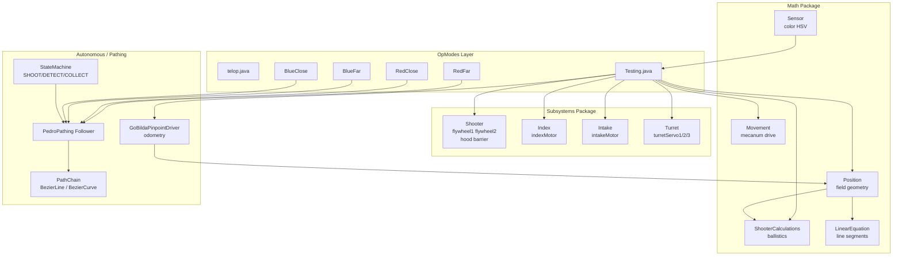

---

## 2. TeleOp Control Loop

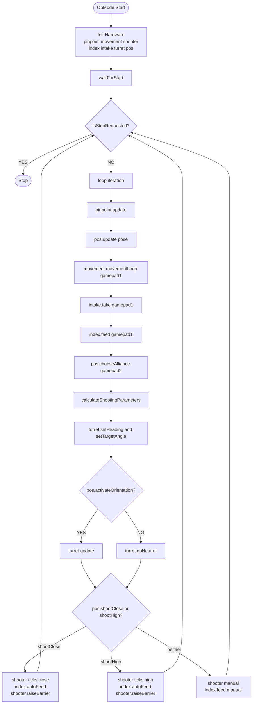

---

## 3. Autonomous State Machine

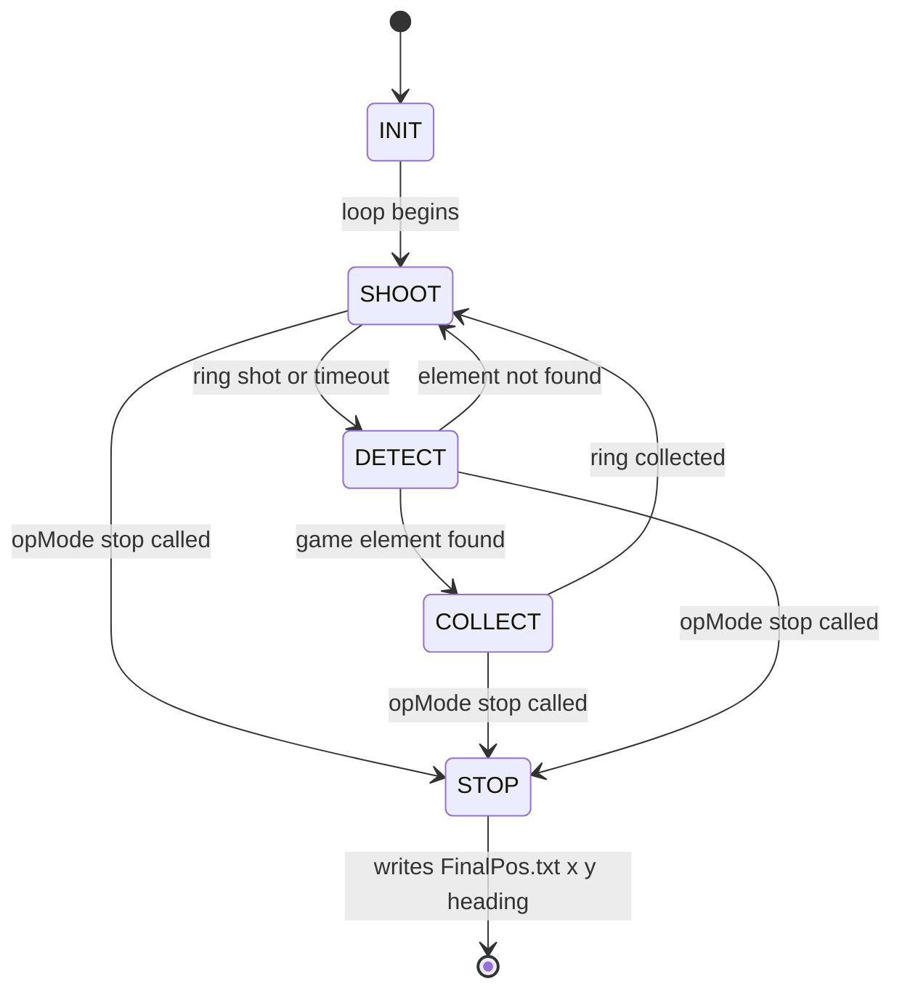

---

## 4. Path Planning Routes

```mermaid
flowchart LR
    subgraph RF["RedFar"]
        RF1["Start\n87, 8"] -->|BezierLine| RF2["Collect\n134, 9"]
        RF2 -->|BezierLine| RF3["Return\n94, 8.5"]
        RF3 -->|BezierLine| RF4["Park\n111, 16"]
    end
    subgraph BF["BlueFar"]
        BF1["Start\n57, 8"] -->|BezierLine| BF2["Collect\n10, 9"]
        BF2 -->|BezierLine| BF3["Return\n50, 8.5"]
    end
    subgraph RC["RedClose"]
        RC1["Start\n120, 144"] -->|BezierCurve 3pt| RC2["Shoot Zone\n84, 84"]
        RC2 -->|BezierCurve 4pt| RC3["Score\n127, 60"]
        RC3 -->|BezierCurve| RC4["Return\n84, 84"]
        RC4 -->|BezierCurve 43deg| RC5["Score 2\n129, 63"]
    end
    subgraph BC["BlueClose"]
        BC1["Start\n24, 144"] -->|BezierCurve 3pt| BC2["Shoot Zone\n60, 84"]
        BC2 -->|BezierCurve 4pt| BC3["Score\n17, 60"]
        BC3 -->|BezierCurve| BC4["Return\n60, 84"]
        BC4 -->|BezierCurve 137deg| BC5["Score 2\n15, 63"]
    end
```

---

## 5. Mecanum Drive Math

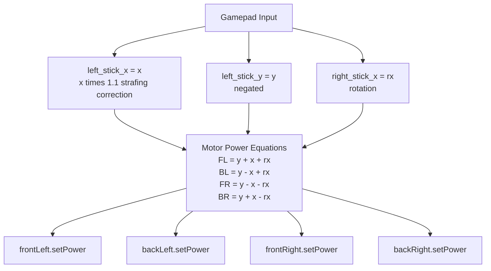

---

## 6. Shooter Ballistics Pipeline

```mermaid
flowchart TD
    IN["Inputs\nrobotX robotY\nrobotVelocityX robotVelocityY\ngoalX=130 goalY=130\ngoalHeight=45in\nentryAngle=-45deg"]
    IN --> D1["Distance and Angle\ndx = goalX - robotX\ndy = goalY - robotY\ndistance = sqrt dx2 plus dy2\nangleToGoal = atan2 dy dx"]
    D1 --> D2["Launch Angle Alpha\nalpha = atan 2h divided d minus tan entryAngle\ncosAlpha and tanAlpha computed"]
    D2 --> D3["Initial Speed v0\nnumerator = g times d squared\ndenom = 2 cos2Alpha times d tanAlpha minus h\nv0 = sqrt num divided denom\ng = 386.1 in per s2"]
    D3 --> D4["Velocity Compensation\nrobotSpeed = sqrt vx2 plus vy2\nrobotVelAngle = atan2 vy vx\ndeltaAngle = velAngle minus angleToGoal\nvRadial = neg cos delta times speed\nvTangential = sin delta times speed"]
    D4 --> D5["Compensated Angle\nvx = v0 cosAlpha\ntimeToGoal = d divided vx\nvxComp = vx plus vRadial\nvxNew = sqrt vxComp2 plus vTang2\nlaunchAngle = atan vy divided vxNew\nclamped 35deg to 45deg"]
    D5 --> D6["Output Parameters\nhoodServoPos = linear interp angle\nflywheelSpeed = a times launchSpeed plus b\nturretOffset = atan vTang divided vxComp\ntargetTurret = angleToGoal plus offset"]
    D6 --> OUT["ShootingParameters\nlaunchAngle rad\nlaunchSpeed in per s\nhoodServoPosition\nflywheelSpeed ticks\ndistanceToGoal\nturretOffsetAngle\ntargetTurretAngle"]
```

---

## 7. Position and Zone Detection

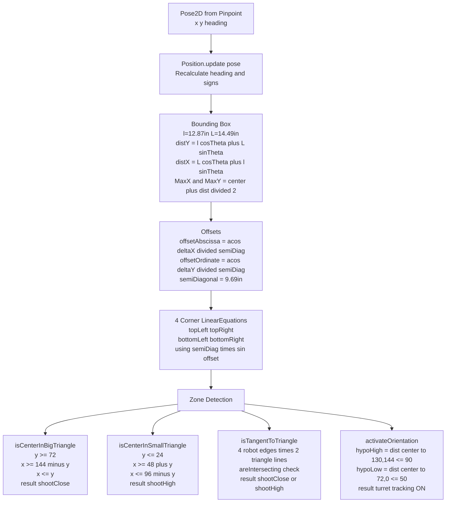

---

## 8. LinearEquation and Intersection Math

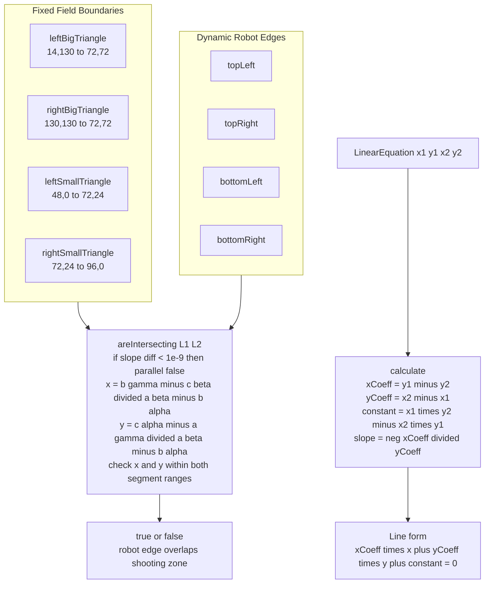

---

## 9. Color Sensor Logic

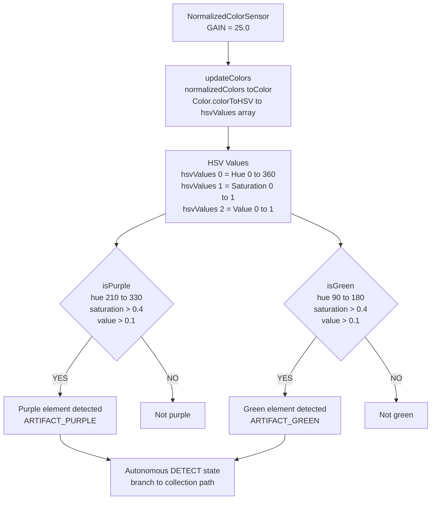

---

## 10. Turret Control Loop

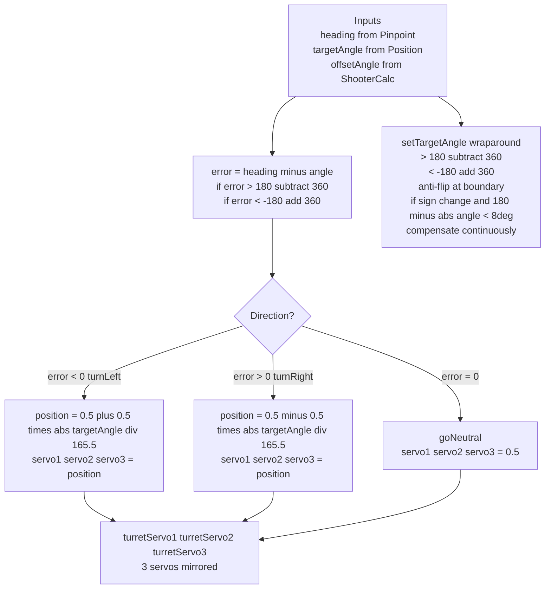

---

## 11. Shooter Subsystem Control

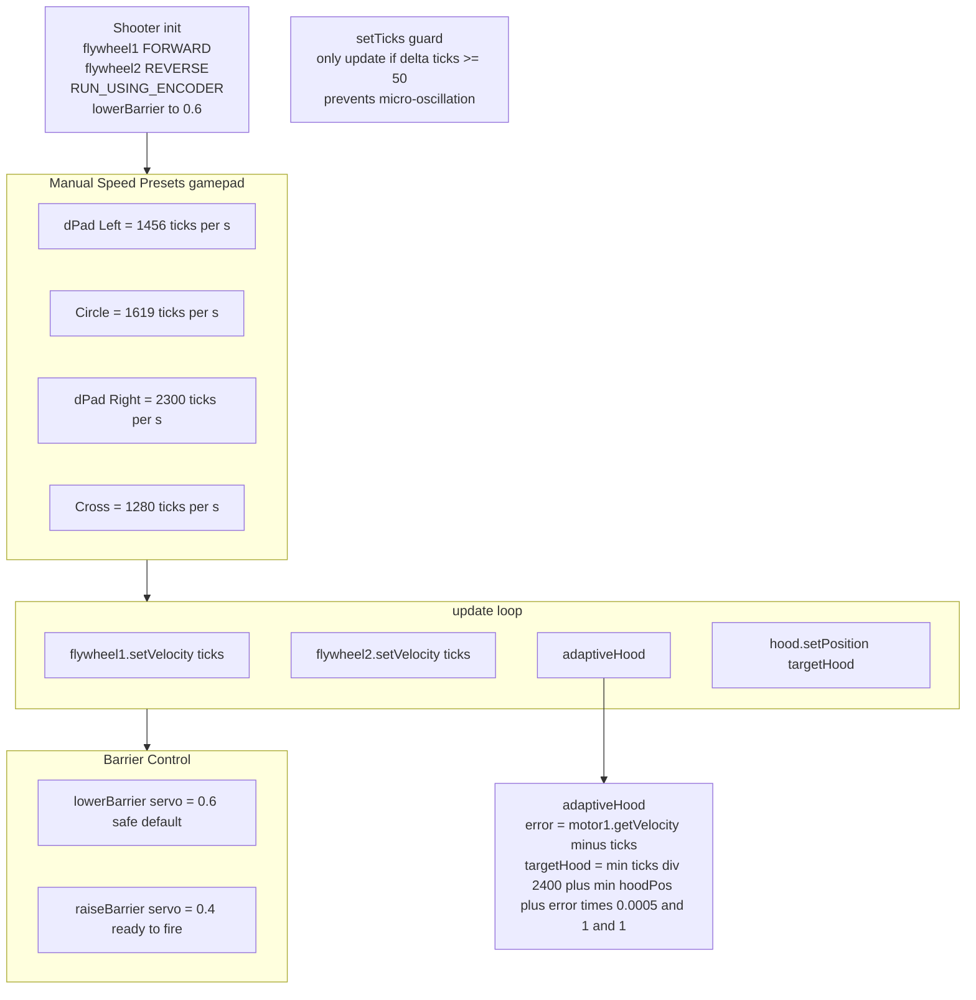

---

## 12. Pose Persistence Sequence

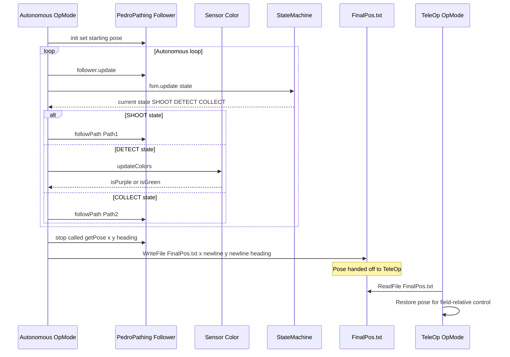

---

## Mathematical Formulas Reference

### Mecanum Drive

```
FL = y + x + rx
BL = y - x + rx
FR = y - x - rx
BR = y + x - rx
```

- `x` = strafe (left_stick_x * 1.1)
- `y` = forward (-left_stick_y)
- `rx` = rotation (right_stick_x)

### Projectile Launch Speed

```
alpha = atan(2h/d - tan(entryAngle))
v0 = sqrt( g * d^2 / (2 * cos^2(alpha) * (d*tan(alpha) - h)) )
g = 386.1 in/s^2
```

### Flywheel Speed (Linear Calibration)

```
flywheelSpeed = a * launchSpeed + b
```

### Hood Servo Position

```
slope = (minServoPos - maxServoPos) / (minHoodAngle - maxHoodAngle)
position = slope * (angleDeg - minHoodAngle) + minServoPos
position = clamp(position, 0.0, 1.0)
```

### Turret Velocity Offset

```
vRadial = -cos(velAngle - goalAngle) * robotSpeed
vTangential = sin(velAngle - goalAngle) * robotSpeed
turretOffset = atan(vTangential / vxCompensated)
targetTurret = angleToGoal + turretOffset
```

### Color Sensing HSV Thresholds

```
Purple: hue in [210, 330], saturation > 0.4, value > 0.1
Green:  hue in [90,  180], saturation > 0.4, value > 0.1
```

### Robot Bounding Box

```
distY = l*cos(heading) + L*sin(heading)
distX = L*cos(heading) + l*sin(heading)
l = 12.874 in,  L = 14.488 in,  semiDiagonal = 9.691 in
```

### Shooting Zone (Big Triangle - shootClose)

```
y >= 72
x >= 144 - y
x <= y
```

### Shooting Zone (Small Triangle - shootHigh)

```
y <= 24
x >= 48 + y
x <= 96 - y
```

---

## FTC Control Award Checklist

| Criteria | Implementation |
|----------|----------------|
| Robust architecture | Modular class-based design, isolated subsystems |
| Clear control logic | Encapsulated motor/servo logic, teleop/autonomous split |
| Sensor integration | Full color sensor with HSV thresholds |
| Error handling | isStopRequested checks, adaptive hood control |
| Mathematical modeling | Ballistics, geometry, kinematics classes |
| Data logging | Telemetry and pose data via FinalPos.txt |
| Tuning support | Centralized Constants, path abstractions |
| Documentation | This file plus inline code comments |
| Best practices | Hardware map abstraction, safe initialization |
| Testing | Pre-movement safety checks, neutral resets |

---

## Software Engineering Best Practices

- **Separation of concerns:** Each subsystem has a dedicated class.
- **Centralized constants:** Tuning via `Constants` and config files.
- **Explicit initialization:** All hardware mapped and set to zero/neutral before start.
- **Robust error handling:** Defensive programming with isStopRequested and adaptive controls.
- **Safe gamepad integration:** No uncontrolled actions; all powers managed via state.
- **Reusability:** Autonomous uses path chains and state machines for flexible routine design.
- **Pose persistence:** Final robot pose written to file for cross-mode coordinate continuity.

---

## References

- [TeamCode Source](https://github.com/bogdanbuzgaru/Natio-Decode/tree/main/TeamCode/src/main/java/org/firstinspires/ftc/teamcode)
- [OpModes](https://github.com/bogdanbuzgaru/Natio-Decode/tree/main/TeamCode/src/main/java/org/firstinspires/ftc/teamcode/opModes)
- [Autonomous Classes](https://github.com/bogdanbuzgaru/Natio-Decode/tree/main/TeamCode/src/main/java/org/firstinspires/ftc/teamcode/autonomous)
- [Subsystems](https://github.com/bogdanbuzgaru/Natio-Decode/tree/main/TeamCode/src/main/java/org/firstinspires/ftc/teamcode/subsystems)
- [Math Helpers](https://github.com/bogdanbuzgaru/Natio-Decode/tree/main/TeamCode/src/main/java/org/firstinspires/ftc/teamcode/math)
